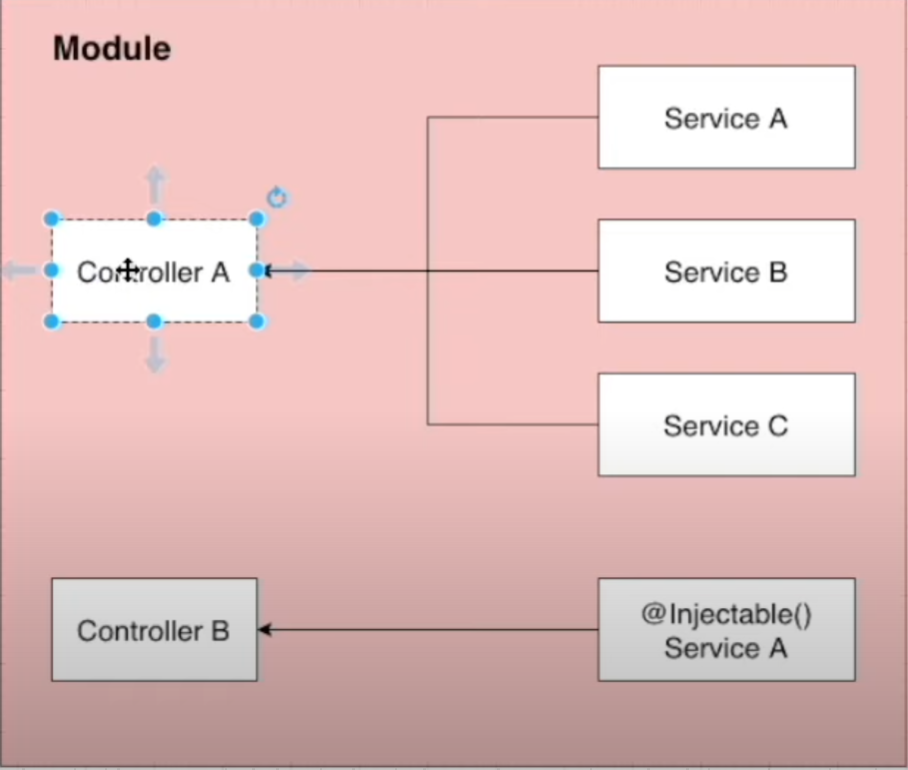

<h1>따라하면서 배우는 NestJS</h1>

[유튜브 링크](https://www.youtube.com/watch?v=3JminDpCJNE&list=PLR7iTHNp5vT2pCv4KRK3HlfNtPwWseJbE&index=2&t=481s&ab_channel=JohnAhn)


<h2> 1. NestJS 소개</h2>

<h3>(1) NestJS란?</h3> 

효율적이고 확장가능한 Node.js 서버측 어플리케이션을 구축하기 위한 프레임워크. Progressive JavaScript를 사용하고 typescript로 빌드되고 OOP, FP, FRP(Functional Reactive Programming) 요소를 사용할 수 있게 해준다.

<h3>(2) NestJS는 내부적으로 어떻게 구성되었나요?</h3>

내부적으로는 Express(기본값)와 같은 강력한 http 서버 프레임워크를 사용하며 선택적으로는 fastify를 사용하도록 구성할 수 있다.
NestJS는 이러한 공통 Node.js 프레임워크 위에 추상화 수준을 제공하지만, api를 개발자에게 직접 노출한다. 이를 통해 개발자는 기본 플랫폼에서 사용할 수 있는 수많은 타사 모듈들을 자유롭게 사용할 수 있다.

<h3>(3) NestJS의 철학</h3>

Node.js를 위한 훌륭한 라이브러리, 도우미 및 도구가 많이 존재하지만 이들 중 어느 것도 아키텍쳐의 주요 문제를 효과적으로 해결하지 못한다. NestJS는 개발자와 팀이 고도로 테스트 가능하고 확장 가능하며 느슨하게 결합되고 윱지 관리가 쉬운 어플리케이션을 만들 수 있는, 즉시 사용 가능한 어플리케이션 아키텍쳐를 제공한다. 이 아키텍처는 angular에서 크게 영감을 받았다.

<h3>(4) NestJS 공식 문서</h3>

[공식 문서](https://www.docs.nestjs.com)

<h2> 2. CRUD 앱을 구성하며 NestJS 기본 구성 배우기</h2>
<h3>(0) NestJS cli로 NestJS 시작하기</h3>
* Node.js 사전설치가 필요합니다.

1. ```npm i -g @nestjs/cli```
2. ```nest new project-name```

<h3>(1) 게시판 형식 알아보기</h3>
제목, 성격(공개/비공개), 내용으로 이루어진 게시판 만들어보기

이 앱을 만들 때 NestJS에서 사용할 것들 (앱 구조)


게시글에 관한 모듈과 그 게시글을 만드는 사람에 대한 인증 모듈이 필요하다. 그리고 각 모듈을 구성하는 Controller, Service, Repository 등이 있는데 NestJS는 이것들이 어떠한 용도로 사용되는지 알아본다.

<h3>(2) NestJS가 설치한 프로그램 살펴보기</h3>

* .eslintrc.js: 개발자들이 특정한 규칙을 가지고 코드를 깔끔하게 짤 수 있도록 도와주는 라이브러리. 타입스크립트를 쓰는 가이드라인 제시, 문법에 오류가 나면 알려줌.
* .prettierrc: 코드 형식을 맞출 때 사용. 작은따옴표를 사용할지 큰따옴표를 사용할지 등. indent 값을 2로 할지 4로 할지 등. 코드 포맷터 역할.
* nest-cli.json: NestJS 자체의 설정을 다룰 때 사용. 
* tsconfig.json: 어떻게 타입스크립트를 컴파일할지 설정.
* tsconfig.build.json: tsconfig.json의 연장선상에 있는 파일. build를 할 때 필요한 설정을 관리. "excludes"에서는 빌드할 떄 필요없는 파일들을 명시함.
*  /src: 대부분의 비즈니스 로직을 작성하는 곳.
   *  /src/main.ts: 앱을 생성하고 실행
  
   ``` 
   async function bootstrap() {
        const app = await NestFactory.create(AppModule); // 가장 큰 root 모듈을 여기서 생성
        await app.listen(3000); // 3000번 포트에서 어플리케이션을 실행하겠음
    }
    실행: npm run start:dev
    ```
   *  app.module.ts: 앱 모듈을 정의.

<h3>(4) 기본 구조에서 살펴보는 NestJS 로직 흐름</h3>
프로그램을 실행하면 Hello World!가 출력된다. 이 코드는 어디서 출력되는걸까?
app.service.ts에서 출력되고 있다. 이 코드는 어떤 과정을 거쳐서 출력되는걸까?
main.ts에서 

```await NestFactory.create(AppModule)``` 을 하고 있다. AppModule을 가보자. (app.module.ts에 있음)
app.module.ts를 보면 ```AppController, AppService``` 가 등록이 되어있다. 
클라이언트가 보낸 요청은 ```AppController ```로 온다.
```
// app.controller.ts
@Get()
  getHello(): string {
    return this.appService.getHello(); // 요청이 오면 appService.getHello()로 응답한다.
  }
```
```
// app.service.ts
@Injectable()
export class AppService {
  getHello(): string {
    return 'Hello World!'; // 여기서 Hello World!를 리턴했기 때문에 브라우저에 출력이 된다.
  }
}
```


<h3>(5) NestJS 모듈 알아보기</h3>

* 모듈은 @Module() 데코레이터로 주석이 달린 클래스이다. @Module() 데코레이터는 NestJS가 어플리케이션 구조를 구성하는 데 사용되는 메타데이터를 제공한다.
* 각 응용 프로그램에는 하나 이상의 모듈(root module)이 있다. root module은 NestJS가 사용하는 시작점이다.
* 모듈은 밀접하게 관련된 기능들의 집합이기 때문에 기능별로 구성 요소를 만드는 것이 효과적이다.
* 같은 기능에 해당하는 것들은 하나의 모듈 폴더에 넣어 사용한다.
* 모듈은 기본적으로 싱글톤이기 때문에 여러 모듈간에 쉽게 공급자의 동일한 인스턴스를 공유할 수 있다.

<h3>(6) Board Module 생성하기</h3>

0. 파일정리하기: app.module.ts와 main.ts만 남기고 모두 삭제한다.
   
1. 모듈 생성하기: ```nest g module boards ``` (자동으로 생성되고 app.module.ts에도 업데이트됨)
```
    nest: using nest cli
    g: generate
    module: schematic that I want to create
    boards: name of the schematic
```
<h3>(7) Controller 알아보기</h3>
1. Controller 알아보기
   * Controller란? 들어오는 요청을 처리하고 클라이언트에 응답을 반환한다.
   * Controller는 @Controller 데코레이터로 클래스를 데코레이션하여 정의한다.

```
@Controller('/boards')
export class BoardController {

}
```

데코레이터는 인자를 Controller에 의해 처리되는 경로로 받는다.
   * Handler란? @Get, @Post, @Delete 등과 같은 데코레이터로 장식된 컨트롤러 클래스 내의 단순한 메소드.
```
    @Controller('/boards')
    export class BoardController {
        @get()
        getBoards(): string {
            return 'This action returns all boards';
        }
        @get('/:id')
        getBoard(): string {
            return 'This action returns specific board';
        }

    }
```
1. Controller 생성하기: ```nest g controller boards --no-spec ``` 
```
    --no-spec: no test code
```
이후에는 boards.controllers.ts에 코드를 작성해주면 된다.

1. Service 생성하기: ```nest g service boards --no-spec ```
* Service에는 db와 관련된 로직을 처리한다.
* @Injectable() 데코레이터는 NestJS가 다른 컴포넌트에서 이 서비스를 사용할 수 있도록 해준다.
* BoardsController에서 BoardsService 이용할 수 있게 하기! (Dependency Injecetion)
```
  // boards.common.ts
@Controller('boards')
export class BoardsController {
    boardsService: BoardsService;               // 3. 하지만 TS에서는 선언한 값만 객체의 property로 사용할 수 있기 때문에 다음과 같이 선언해준다.

    constructor(boardsService: BoardsService) { // 1. boardsService parameter에 BoardsService 객체를 타입으로 지정해준다.
        this.boardsService = boardsService;     // 2. 이 boardsService parameter를 BoardsController 클래스 안에서 사용하기 위해 this.boardsService property에 boardsService parameter를 할당해준다.
    }
}
// 4. 이렇게 갖게된 boardsService property를 이용해서 BoardsController 내에서 사용할 수 있다.
```
↓ 
접근제한자를 이용해서 소스 간단하게 수정하기: 
    JavaScript에서는 private, protected같은 접근 제한자를 사용할 수 없지만, TypeScript에서는 사용할 수 있다.
    접근제한자(public, protected, private)을 생성자(constructor) parameter에 선언하면 접근제한자가 사용된 생성자 parameter는 암묵적으로 클래스 property로 선언된다.
```
export class BoardsController {
    constructor(private boardsService: BoardsService) {} // constructor 안에서 의존성 주입이 일어난다. BoardsService가 type으로 들어가있다.
}
```


<h3>(8) Providers, Service 알아보기</h3>
* Providers란? NestJS의 기본 개념. 대부분의 기본 NestJS 클래스는 서비스, 리포지토리, 팩토리, 헬퍼 등 Providers로 취급될 수 있다.
  Provider의 주요 아이디어는 종속성을 주입할 수 있다는 것이다. 객체는 서로 다양한 관계를 만들 수 있으며, 객체의 인스턴스를 연결하는 기능은 대부분 NestJS 런타임 기능에 위임될 수 있다.

  
  // Controller는 많은 것들을 필요로 하지만, 그 모든 것들을 전부 Controller 내부에서 구현할 수는 없다. 그렇기 때문에 여러 서비스들을 만든 뒤, 컨트롤러에서 사용할 수 있도록 넣어준다. (종속성 주입)

* Service란? 소프트웨어 개발에 사용되는 공통적인 개념.(NestJS나 JS만의 개념이 아님)
  Injectable 데코레이터로 감싸져서 모듈에 제공되며, 이 서비스 인스턴스는 어플리케이션 전체에서 사용될 수 있다.
  서비스는 컨트롤러에서 데이터의 유효성 체크를 하거나, db에 아이템을 생성하는 등의 작업을 처리한다.

* Service를 Controller에서 이용할 수 있는 방법(Dependency Injection)
  
* Provider 등록하기: module 파일의 providers 항목 안에 해당 모듈에서 사용하고자 하는 Provider를 넣어주면 된다.
```
@Module({
  controllers: [BoardsController],
  providers: [BoardsService]
})
```
<h3>(9) CRUD app 구현해보기</h3>
[1] 모든 게시물 데이터를 db에서 가져오기

* 어디서 구현? service에서.
```
// boards.service.ts
@Injectable()
export class BoardsService {
    private boards = [];    // private를 사용한 이유는? 다른 컴포넌트에서 boards값에 접근하려는 것을 방지하기 위해.

    getAllBoards() {
        return this.boards;
    } // 이렇게 만든 getAllBoards()는 boardsController에서 사용한다.
}
```
```
// boards.controller.ts
@Controller('boards')
export class BoardsController {
    constructor(private boardsService: BoardsService) {}
    
    @Get()
    getAllBoard() {
        return this.boardsService.getAllBoards() // service에서 만든 getAllBoards() 사용
    }
}
```
* 클라이언트의 요청이 처리되는 과정:
  1. 클라이언트가 요청을 보낸다.
  2. 해당 요청은 컨트롤러로 가며, 컨트롤러에서 알맞은 요청 경로로 라우팅해준다.
  3. 요청은 라우팅된 핸들러로 들어가며, 그 뒤에 요청을 처리하기 위해 서비스로 들어간다.
  4. 해당 요청에 맞는 로직을 서비스에서 처리하고, 컨트롤러에 리턴값을 보내준다.
  5. 컨트롤러에서 클라이언트로 결과값을 보내준다.

[2] Board Model 정의하기
* 모델을 정의하기 위해서는? Class나 Interface를 이용한다. (여기서는 Interface 사용)
  1. Class: 변수의 타입 체크, 인스턴스 생성
  2. Interface: 변수의 타입 체크 
```
// board.model.ts
export interface Board {
    id: string;
    title: string;
    description: string;
    status: ; // 
}
```
여기서 status는 'PUBLIC' 과 'PRIVATE' 둘 중 하나의 값만 오게 하고 싶다. 그러기 위해 TS의 enumeration을 이용한다.
```
// board.model.ts
export enum BoardStatus {
    PUBLIC = 'PUBLIC',
    PRIVATE = 'PRIVATE',
}
```
* 사용자에게 보여줄 board의 데이터 형식을 model에서 모두 정의했기 때문에 boards의 data type을 지정해준다.
```
// boards.service.ts
  export class BoardsService {
    private boards: Board = []; // 이렇게 쓰면 error가 나는 이유는? Board는 보드 하나만이지만 뒤에 배열을 넣어놓았기 때문에.
    private boards: Board[] = [];

    getAllBoards(): Board[] { // 여기도 type을 지정해줄 수 있다. (return값의 type)
        return this.boards;
    }
}
// boards.controller.ts
getAllTask(): Board[] { // 여기에도 type 지정
        return this.boardsService.getAllBoards();
    }

```
이렇게 type을 세세하게 정의해주면 좋은 이유:
type을 정의해주는 것은 선택사항이지만, 원하는 type과 다른 코드를 사용할 때 에러가 나는 것을 방지해줄 수 있다.
또한 코드를 읽는 입장에서 더 코드를 쉽게 이해하며 읽을 수 있다.

[3] 게시물 생성하기
```
// boards.service.ts
createBoard(title: string, description: string) {
    const board: Board = {
      title: title, // title만 써도 됨
      description: description, // description만 써도 됨
      status: BoardStatus.PUBLIC,
    }
}
여기까지 하면 board에 에러가 발생하는데, model에서 정의한 Board에는 id가 있지만 여기에는 없기 때문이다. 우선 uuid 모듈을 사용하기로 한다.
    const board: Board = {
      id: uuid,
      ...
    }
```
이제 controller부분을 작업하자. request와 response 처리를 controller에서 하면 된다.
```
// boards.controller.ts
@Post()
createBoard() {

}
```
NestJS에서 body의 request를 받는 방법: ```@Body() body```
body중 일부만 받고싶으면? ```@Body('title') title, @Body('description') description```
```
// boards.controller.ts
@Post()
createBoard(
    @Body('title') title: string,
    @Body('description') description: string,
): Board {
  return this.boardsService.createBoard(title, description);
}
```
return값에도 type을 지정하고 싶은데 ```createBoard(): Board[]```로 하면 안되는 이유는?
service의 createBoard 메소드가 ```return board```이기 때문.

[4] DTO(Data Transfer Object) 알아보기

* DTO란? 
  계층간 데이터 교환을 위한 객체. DB에서 데이터를 얻어 Service나 Controller 등으로 보낼 때 사용하는 객체.
DTO는 데이터가 네트워크를 통해 전송되는 방법을 정의하는 객체이다.
interface나 class를 이용해 정의할 수 있다. (일반적으로 class를 추천) - 왜? 클래스는 인터페이스와 달리 런타임에서 작동하기 때문에 파이프 같은 기능을 이용하기에 더 유용함.
* DTO를 쓰는 이유는?
  데이터 유효성을 체크하는 데 효율적임
  더 안정적인 코드로 만들어 줌
  TS의 타입으로도 사용됨
* 그냥 @Body()를 이용해도 되지 않나요?
  property가 예제와는 다르게 엄청나게 많다면? 정의만 수십줄이 필요할 것이고 에러가 발생하기 쉬움.
  이 상태에서 갑자기 한 곳에서 property를 변경해야 된다면? 다른 곳에 쓰인 모든 곳의 property를 일일히 변경해야 할 것임.
  이렇게 되면 어플리케이션을 유지보수하기 굉장히 힘들어지기 때문에, 그냥 DTO를 이용하는 것이 더 안정적이고 효율적임.
* DTO 생성하기
```
// /boards/dto/create-board-dto.ts
export class CreateBoardDTO{
  title: string;
  description: string;
}
controller와 service에 DTO 적용하기

// boards.controller.ts
@Post()
createBoard (@Body() createBoardDTO: CreateBoardDTO): Board {
    return this.boardsService.createBoard(createBoardDTO);
}

// boards.service.ts
createBoard(createBoardDTO: CreateBoardDTO) {
    const {title, description} = createBoardDTO;
    const board: Board = {
        id:'1',
        title,
        description,
        status: BoardStatus.PUBLIC,
    }
```

[5] id로 특정 게시물 가져오기
```
// boards.service.ts
getBoardById(id: string): Board {
  return this.boards.find((board) => board.id === id) // boards가 array이기 때문에
}

// boards.controller.ts
@Get('/:id)
getBoardById(@Param('id') id: string) { // 여러개의 parameter를 한번에 가져오고 싶다면? @Param() params: string[] 이용.
  return this.service.getBoardById(id)
}
```

[6] id로 특정 게시물 지우기
```
// boards.service.ts
deleteBoard(id: string): void {   // return하지 않기 때문에 따로 return하지 않음. 따라서 type을 void로 설정
  this.boards = this.boards.filter((board) => board.id !== id)
}

// boards.controller.ts
@Delete('/:id)
getBoardById(@Param('id') id: string) { // 여러개의 parameter를 한번에 가져오고 싶다면? @Param() params: string[] 이용.
  return this.service.deleteBoard(id)
}
```

[7] 특정 게시물의 상태 업데이트하기 (PRIVATE <-> PUBLIC)
```
// boards.service.ts
updateBoardStatus(id: string, status: BoardStatus): Board {
  let targetBoard = this.getBoardById(id);
  targetBoard.status = status;
  return targetBoard;
}

// boards.controller.ts
@Patch('/:id/status)
updateBoardStatus(@Param('id') id: string, @Body('status') status: BoardStatus) { 
  return this.service.updateBoardStatus(id);
}
```
<h3>(10) Pipe 알아보기</h3>

* Pipe란?
  @Injectable() 데코레이터로 주석이 달린 클래스.
  data transformation과 validation을 위해 사용함.
  파이프는 컨트롤러 경로 처리기에 의해 처리되는 인수에 대해 작동한다.
  메소드가 호출되기 직전에 파이프를 삽입하고, 파이프는 메소드로 향하는 인수를 수신한 뒤 이에 대해 작동한다.
* data transformation이란?
  입력 데이터를 원하는 형식으로 변환할 수 있다. (문자열 -> 정수 등)
  숫자를 받기 원하는데 문자열 형식으로 오면 파이프에서 자동으로 숫자로 변경해준다.
* data validation이란?
  입력 데이터를 평가하고 유효한 경우 그대로 전달한다.
  데이터가 올바르지 않을 때는 에러를 발생시킨다.
* Pipe는 위의 두 가지 경우에서 Route Handler가 처리하는 인수에 대해 작동한다.
* Binding Pipes
  1) Handler-level
    ```
    @Post()
    @UsePipes(pipe) // createBoard 하나에 대해 작동함
    createBoard () {
      ...
    }
    ```
  2) Parameter-level
    ```
    @Post()
    createBoard (@Body('title', ParameterPipe) title) {  // 특정 parameter에 대해서만 작동함
      ...
    }
    ```
  3) Global-level
   
   ```
   // main.ts
   async function bootStrap() {
    const app = await NestFactory.create(AppModule);
    app.useGlobalPipes(GlobalPipes); // 어플리케이션 레벨의 파이프. 클라이언트에서 들어오는 모든 요청에 적용된다. main.ts에서 작동함
    await app.listen(3000);
   }
   ```
* Built-in Pipes
  파이프를 직접 작성할 수도 있지만, NestJS에서 기본적으로 제공하는 파이프들이 있다.
  ```ValidationPipe, ParseIntPipe, ParseBoolPipe, ParseArrayPipe, ParseUUIDPipe, DefaultValuePipe```

<h3>(11) Pipe를 이용한 유효성 체크</h3>
boards의 title, description에 대해 유효성 체크를 해보자.

필요한 모듈 설치: ```npm i class-validator class-transformer```
[공식문서 확인](https://github.com/typestack/class-validator#manual-validation)
```
// create-board-dto.ts
export class ClassBoardDTO {
  @IsNotEmpty()
  title: string;

  @IsNotEmpty()
  description: string;
}

// boards.controller.ts
@Post()
@UsePipes(ValidationPipe)
createBoard() {
  ...
}
```

* custom pipe를 이용해 유효성 체크하기
  - 구현 방법: 
  PipeTransform이라는 인터페이스를 새롭게 만들 커스텀 파이프에 구현해주어야 한다.
  이 PipeTransform 인터페이스는 모든 파이프에서 구현해주어야 하는 인터페이스이다.
  그리고 이것과 함께 모든 파이프는 transform() 메소드를 필요로 한다. 이 메소드는 인자(arguments)를 처리하기 위해 사용된다.

  - transform(a, b) 메소드
  첫번째 parameter는 처리가 된 인자의 값(value)이며, 두번째 parameter는 인자에 대한 메타 데이터를 포함한 객체이다.
  transform() 메소드에서 리턴된 값은 Route 핸들러로 전해진다. 예외가 발생하면 클라이언트로 바로 전해진다.
  - custom pipe 구현하기(board.status에 대한 유효성 체크)
  
```
// boards/pipes/board-status-validation.pipe.ts
export class BoardStatusValidationPipe implements PipeTransform {
  transform(value: any, metadata: ArgumentMetadata) {
    console.log({ // value와 metadata가 뭔데?
      value: value,         // 사용자가 입력한 값
      metadata: metadata,   // type: 'body', data: 'status'
    })

    return value;
  }
}

// boards.controller.ts
@Patch()
updateBoardStatus(
  @Body('status', BoardStatusValidationPipe) status: BoardStatus,
)
...
```
구현할 기능: status는 'PUBLIC', 'PRIVATE'만 올 수 있기 때문에 이외의 값이 올 경우 에러를 발생시키기
```
export class BoardStatusValidationPipe implements PipeTransform {
  readonly StatusOptions = [  // readonly prefix는 속성을 읽기 전용으로 만들 때 사용한다. 읽기 전용 멤버는 클래스 외부에서 엑세스할 수 있지만 값을 변경할 수는 없다.
    BoardStatus.PRIVATE,
    BoardStatus.PUBLIC,
  ]

  transform(value: any) {
    value = value.toUpperCase();
    if (!this.isStatusValid(value)) {
      throw new BadRequestException(`${value} isn't in the status options`)
    }
  }

  private isStatusValid(status: any) {
    return this.StatusOptions.includes(status);
  }
}
```
<h3>(12) Error 상황 처리하기</h3>
[1] 특정 게시물을 찾을 수 없을 때 결과값 처리

```
// boards.service.ts
getBoardById() {
  if(!found) {
    throw new NotFoundException();
    // 원하는 메시지를 넣고싶다면?
    throw new NotFoundException('Cannot find Board with this id');
  }
}
```
<h2> 3. MySQL & TypeORM을 이용해서 앱 구성</h2>
<h3>(1) TypeORM</h3>

* TypeORM 소개
  TypeORM은 node.js에서 실행되고 TS로 작성된 객체 관계형 매퍼 라이브러리. 여러 db를 제공함.
* ORM이란?
  객체와 관계형 데이터베이스의 데이터를 자동으로 변형 및 연결하는 작업.
  ORM을 이용한 개발은 객체와 데이터베이스의 변형에 유연하게 사용될 수 있음.
* TypeORM의 장점
  1) 모델을 기반으로 db 테이블 체계를 자동으로 생성해준다.
  2) db에서 개체를 쉽게 삽입, 수정, 삭제할 수 있다.
  3) 테이블 간의 매핑(일대일, 다대다, 일대다)을 만들 수 있다.
  4) 간단한 cli 명령어를 제공한다.
  5) 간단한 코딩만으로 쉽게 ORM 프레임워크를 사용할 수 있다.
  6) 다른 모듈과 쉽게 통합된다.
* 설치하기
  ```npm i typeorm @nestjs/typeorm```
* [문서](https://docs.nestjs.com/techniques/database)
* 어플리케이션에 TypeORM 연결하기
  1) 설정파일 생성: ```src/configs/typeorm.config.ts```
  2) 설정파일 작성
    entities: entity를 이용해서 테이블을 생성하기 때문에 entity 파일이 어디있는지 설정
    synchronize: production 모드에서는 false로 
  3) 루트 모듈에서 import하기
<h3>(2) 게시물을 위한 entity 작성하기</h3>

* 왜 entity를 생성해야 하나요?
  TypeORM을 사용할 때는 클래스를 사용해서 테이블로 변환할 수 있기 때문에 먼저 클래스를 생성한 뒤 클래스 안에 컬럼들을 정의해주면 된다.
* 코드 살펴보기
```
// boards.entity.ts
@Entity()   // Board 클래스가 entity임을 나타내기 위해 사용
export class Board extends BaseEntity {
  @PrimaryGeneratedColumn()   // id 컬럼이 Board entity의 pk임을 나타내기 위해 사용
  id: number;

  @Column()     // 일반적인 다른 컬럼을 나타내기 위해 사용
  title: string;

  @column()
  description: string;

  @Column()
  status: BoardStatus;
}
```
<h3>(2) repository 생성하기</h3>

*  repository란?
  entity 개체와 함께 작동하며 entity 찾기, 삽입, 수정, 삭제 등을 처리함.
* [문서](https://typeorm.delightful.studio/classes/_repository_repository_.repository.html)
* db와 관련된 작업은 서비스에서 하는 게 아닌, repository에서 하면 된다. 이것을 repository pattern이라고도 부른다.

* repository 생성하기
```
// boards.module.ts
imports: [
    TypeOrmModule.forFeature([BoardRepository]),
  ],
```
<h3>(3) file 정리하기</h3>

   1) 게시물 데이터를 정의하기 위해 entity를 이용하기 때문에 ```board.model.ts```의 Board Interface는 필요가 없다. 
하지만 status enum은 필요하기 때문에 이 부분만을 위한 파일을 생성해서 넣어준다: ```board-status.enum.ts```
  2) db와 관련된 로직은 service에서 repository로 이동한다.
  3) controller는 service를 호출, service는 repository를 호출, repository에는 TypeORM 관련 코드를 작성하는 구조를 완성한다.

<h2> 4. 인증 처리 추가(JWT)</h2>
<h3>(1) 인증모듈 구현하기</h3>
이제 실전으로 들어가보자.
처음 프로젝트를 한다고 가정했을 때 작업해야 하는 순서는? 호출하는 구조와 반대로 작업한다.
1. entity 작성
2. repository 작성
3. service 작성
4. controller 작성

<h3>(2) db 예외처리하기</h3>
username에 대해 unique값을 부여하고 싶은데 어떤 방법이 있을까?

1. 먼저 findOne을 해보고 없으면 create한다.이 방법은 db를 두번 처리해야 한다. (x)
2. unique key를 설정한 뒤, db에서 나오는 에러를 받아 처리한다. (o)
```
// users.entity.ts
@Unique(['username'])
export class User extends BaseEntity {
  ...
}
```
typeORM은 이 상황에서 기본적으로 ```500: Internal Server Error```를 반환한다. 이를 핸들링해보자.
```
// users.repository.ts
try {
    await this.save(user);
} catch (error) {
    if (error.code === '23505') {   // console.error를 통해 typeORM error code를 확인
        throw new ConflictException('Existing username');
    }
    else {
        console.error(error);
        throw new InternalServerErrorException();
    }
}
```
<h2> 5. 권한 처리 (Passport)</h2>
<h2> 6. 로그 남기기</h2>
<h2> 7. 배포 전 설정하기</h2>